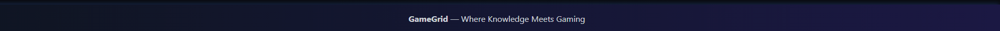
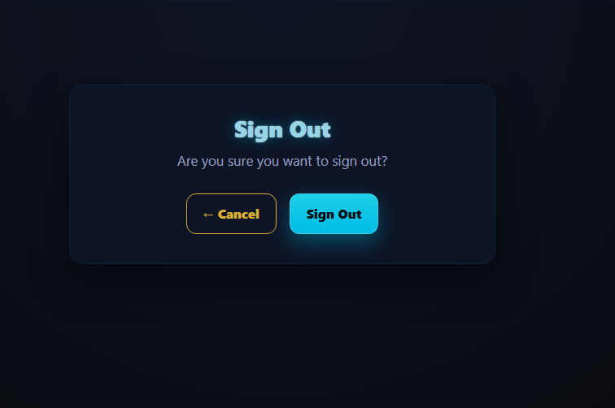
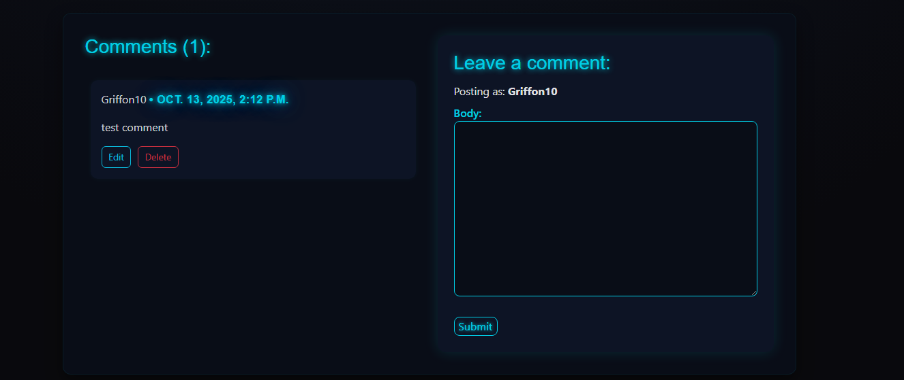
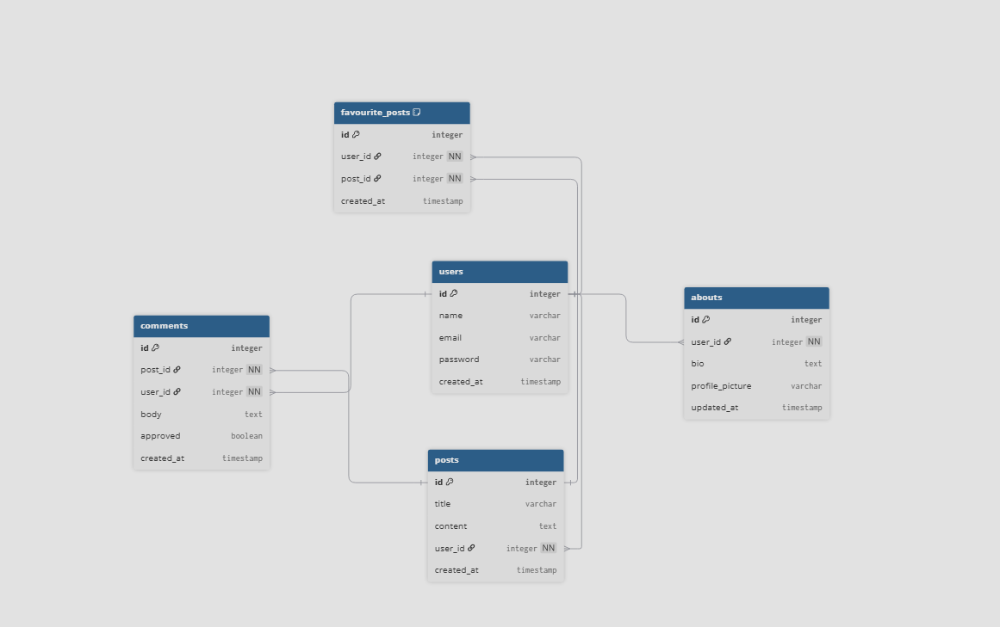
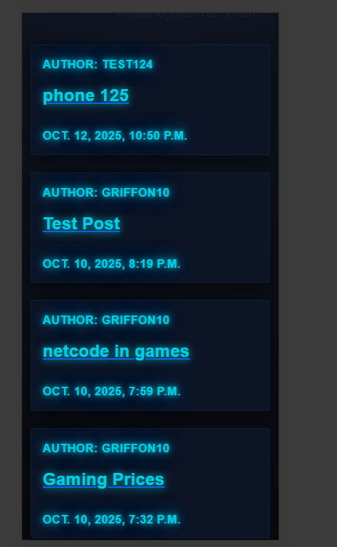
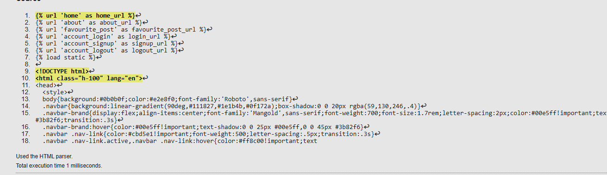

# **GameGrid Blog**

## **Table of Contents**
1. [Introduction](#introduction)  
2. [User Experience (UX) Design](#user-experience-ux-design)  
3. [User Stories](#user-stories)  
4. [Features](#features)  
5. [Future Features](#future-features)  
6. [Entity Relationship Diagram (ERD)](#entity-relationship-diagram)  
7. [Testing](#testing)  
8. [Bugs](#bugs)  
9. [Deployment](#deployment)  
10. [Technologies & Languages Used](#technologies--languages-used)       
11. [Credits](#credits)

## **Introduction**
This is django project created within the weeks provided allowing me to have created the gaming blog website!

This is the GameGrid Blog — a space built by gamers, for gamers. Here, players from all corners of the gaming world can share their thoughts, debate hot topics, and celebrate the games that shape our lives. Whether it’s deep-dive reviews, first impressions of new releases, nostalgic throwbacks, or discussions about the latest gaming news, GameGrid is your arena to speak your mind.

Join the conversation, drop your opinions, and connect with a community that understands your passion for gaming. On GameGrid, every voice matters — from casual players to hardcore pros.

**[Visit the Site](https://gamestarfinal-bdb7a6c9d0d9.herokuapp.com/)** 

## **User Experience (UX) Design**

### **Design Goals**
- Provide an
- Maintains the gaming feel thoughout the website
- Responsiveness Across Devices 

### **Typography**

This project uses two main fonts for a modern gaming aesthetic:

- **Roboto** – for clean, readable body text.  
  Source: [Google Fonts](https://fonts.google.com/specimen/Roboto)

- **Mangold** – for the bold, neon-styled headings and the GameGrid logo.  
  Source: [Google font inspiration](https://fonts.google.com/specimen/Oxanium)

### **Colour Palette**

 - Neon Cyan — #00E5FF
- Electric Blue — #3B82F6
- Neon Orange — #FF8C00
- Bright Amber — #FFA733
- Midnight Navy — #0F172A
- Dark Space Blue — #0B0F1A
- Steel Blue-Gray — #111827
- Muted Gray-Blue — #CBD5E1
 -Cool Gray — #94A3B8
- Soft Off-White — #E2E8F0
- Amber Glow — #FFAE42

[Back to Table of Contents](#table-of-contents)

## **Wireframes**

### Mobile Wireframes
These are my mobile wireframes showing the individual website pages.  
*(The cdesigns are the concept some have little change in final product.)*

  
  

### Desktop Wireframes
These are my Desktop wireframes showing the individual website pages.  
*(The cdesigns are the concept some have little change in final product.)*

  
  
  
  
   
  
   
  

[Back to Table of Contents](#table-of-contents)

## User Stories
## User Stories

### 📰 Open a Post
**As a Site User**, I can click on a post so that I can read the full text.

**Acceptance Criteria**
- **AC1:** When a blog post title is clicked, a detailed view of the post is displayed.

---

###  View Comments
**As a Site User / Admin**, I can view comments on an individual post so that I can read the conversation.

**Acceptance Criteria**
- **AC1:** Given one or more user comments, the admin can view them.
- **AC2:** A site user can click on the comment thread to read the conversation.

---

###  Account Registration
**As a Site User**, I can register an account so that I can comment on a post.

**Acceptance Criteria**
- **AC1:** Given an email, a user can register an account.
- **AC2:** Then the user can log in.
- **AC3:** When the user is logged in, they can comment.

---

### Comment on a Post
**As a Site User**, I can leave comments on a post so that I can be involved in the conversation.

**Acceptance Criteria**
- **AC1:** When a user comment is approved, it becomes visible.
- **AC2:** A user can reply to comments.
- **AC3:** Given more than one comment, there is a conversation thread.

---

### Modify or Delete Comment
**As a Site User**, I can modify or delete my comment on a post so that I can manage my participation in the conversation.

**Acceptance Criteria**
- **AC1:** A logged-in user can modify their comment.
- **AC2:** A logged-in user can delete their comment.

---

###  Manage Posts
**As a Site Admin**, I can create, read, update, and delete posts so that I can manage my blog content.

**Acceptance Criteria**
- **AC1:** A logged-in user can create a blog post.
- **AC2:** A logged-in user can read a blog post.
- **AC3:** A logged-in user can update a blog post.
- **AC4:** A logged-in user can delete a blog post.

---

###  Create Drafts
**As a Site Admin**, I can create draft posts so that I can finish writing the content later.

**Acceptance Criteria**
- **AC1:** A logged-in user can save a draft blog post.
- **AC2:** The user can finish and publish the content later.

---

### Approve Comments
**As a Site Admin**, I can approve or disapprove comments so that I can filter out objectionable comments.

**Acceptance Criteria**
- **AC1:** A logged-in user can approve a comment.
- **AC2:** A logged-in user can disapprove a comment.

### Favorites Functionality

**As a Django logged-in user**, I can add or remove blog posts from my favorites and view them later so that I can quickly access posts I like.

**Acceptance Criteria**
- **AC1:** Given a logged-in user, they can mark (add) a blog post as a favorite via a Django view or API endpoint.  
- **AC2:** Given a logged-in user, they can remove a blog post from their favorites via a Django view or API endpoint.  
- **AC3:** Given a logged-in user, they can view a list of all blog posts they’ve marked as favorites on a dedicated **“Favorites”** page or API endpoint.

### Create a New Post

**As a logged-in user**, I can create a new blog post using the "Create a New Post" form so that I can share my ideas and updates on the blog.

**Acceptance Criteria**
- Only authenticated (logged-in) users can access the **Create a New Post** page.  
- The form includes input fields for **Title** and **Content**.  
- When the **Publish** button is clicked, the post is submitted and saved.  

[Back to Table of Contents](#table-of-contents)

## Features

### Home Page

   
  <em>Displays the blogs that have been created.</em>

### Footer

   
  <em>Displays the speech within it.</em>

### Authentication
- **Register:** User  Register.

   
  <em>Displays the create account features.</em>

- **Sign-In:** secure login with remember-me.

   
  <em>Displays the sign in screen.</em>

- **Sign-Out:** safe session termination.

   
  <em>Displays the are you sure screen.</em>

### Comments
- Add/edit/delete comments; visible underneath the blog.  

   
  <em>Displays the are you sure screen.</em>

   
  <em>Displays the Verification to delete a comment.</em>

### posts
- Add/edit/delete comments; visible underneath the blog to only users that created the post.  

   
  <em>delete button on created posts by user.</em>

   
  <em>Displays the Verification to delete a .</em>

   
  <em>Displays the form like format to create post.</em>

### Favourite posts
- Add/remove: able to favourite other users post/yourselfs.  

   
  <em>adding any post and ends in this  page , to view.</em>

[Back to Table of Contents](#table-of-contents)

## Future Features

- Pictures that can be implemented on posts to suit the topics to users

## Entity Relationship Diagram

   
  <em>adding any post and ends in this  page , to view.</em>

[View the Entity Relationship Diagram (ERD) on dbdiagram.io](https://dbdiagram.io/d/ERD-update-diagram-68dae805d2b621e42277936d)

[Back to Table of Contents](#table-of-contents)

## Testing

### Manual & Responsive Testing
- Tested on Chrome, edge 
- Devices: desktop, tablet, mobile (e.g., Samsung GaLAXY S8, iPhone SE Pro , iPad Pro)

   
  <em>Displays the post on samsung.</em>

   
  <em>Displays the post on Ipad .</em>

### Validator Testing
- **HTML/CSS:** tested the files using css and html validators

   
  

   

.
  

.
 

.
 

.
 

 

.
 

 

.
- No error in the java script comment
-  In this testing the picture above show yellow or comments in both java/css and python however they arent errors and are more suggestions or some identation issue however it doesnt effet the website at all

### lighthouse testing 
 Google Lighthouse audits for performance, accessibility, SEO (desktop & mobile). 

 

.

 

.

### **Bugs**
- no bugs happend however only minor adjustments on the css

### **Credits**
- Ai usage =  i have used a bit of chatgbt to provide me ideas and errors with code as the development of the project
- dbdiagram = i have used this for ERD diagram
- Coolors = for the colous and reference
- google font = took some inspiration of fonts from the website
- boostrap = took inspiration from some boostrap
- balsamiq = for wire frames