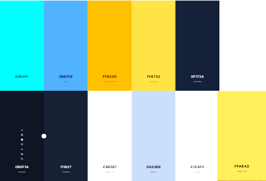

# **GameGrid Blog**

## **Table of Contents**
1. [Introduction](#introduction)  
2. [User Experience (UX) Design](#user-experience-ux-design)  
3. [User Stories](#user-stories)  
4. [Features](#features)  
5. [Future Features](#future-features)  
6. [Entity Relationship Diagram (ERD)](#entity-relationship-diagram)  
7. [Testing](#testing)  
8. [Bugs](#bugs)  
9. [Deployment](#deployment)  
10. [Technologies & Languages Used](#technologies--languages-used)  
11. [License](#license)  
12. [Contact](#contact)  
13. [Acknowledgements](#acknowledgements)  
14. [Credits](#credits)

## **Introduction**
This is django project created within the weeks provided allowing me to have created the gaming blog website!

This is the GameGrid Blog — a space built by gamers, for gamers. Here, players from all corners of the gaming world can share their thoughts, debate hot topics, and celebrate the games that shape our lives. Whether it’s deep-dive reviews, first impressions of new releases, nostalgic throwbacks, or discussions about the latest gaming news, GameGrid is your arena to speak your mind.

Join the conversation, drop your opinions, and connect with a community that understands your passion for gaming. On GameGrid, every voice matters — from casual players to hardcore pros.

**[Visit the Site](https://gamestarfinal-bdb7a6c9d0d9.herokuapp.com/)** 

## **User Experience (UX) Design**

### **Design Goals**
- Provide an
- Maintains the gaming feel thoughout the website
- Responsiveness Across Devices 

### **Typography**

This project uses two main fonts for a modern gaming aesthetic:

- **Roboto** – for clean, readable body text.  
  Source: [Google Fonts](https://fonts.google.com/specimen/Roboto)

- **Mangold** – for the bold, neon-styled headings and the GameGrid logo.  
  Source: [Google font inspiration](https://fonts.google.com/specimen/Oxanium)

### **Colour Palette**

 - Neon Cyan — #00E5FF
- Electric Blue — #3B82F6
- Neon Orange — #FF8C00
- Bright Amber — #FFA733
- Midnight Navy — #0F172A
- Dark Space Blue — #0B0F1A
- Steel Blue-Gray — #111827
- Muted Gray-Blue — #CBD5E1
 -Cool Gray — #94A3B8
- Soft Off-White — #E2E8F0
- Amber Glow — #FFAE42

[Back to Table of Contents](#table-of-contents)

## **Wireframes**
