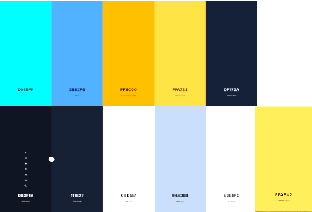
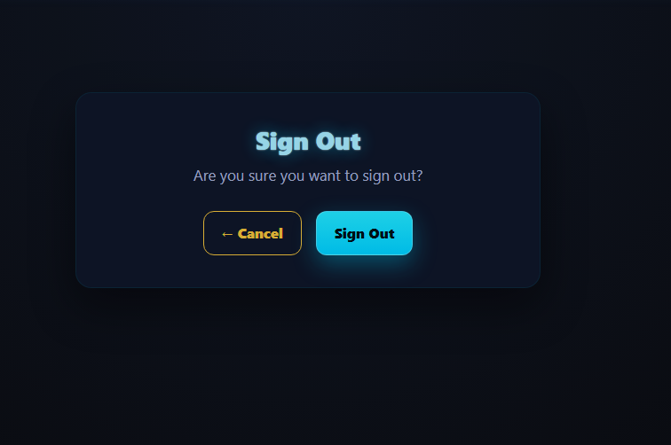
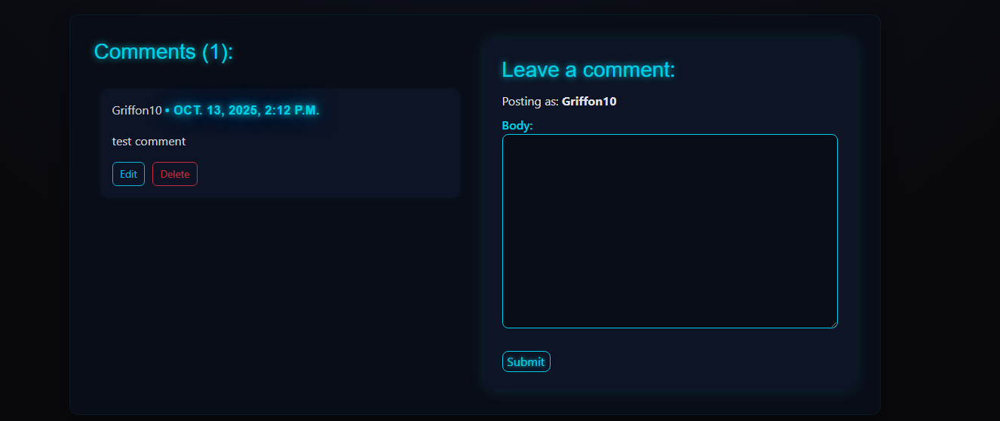
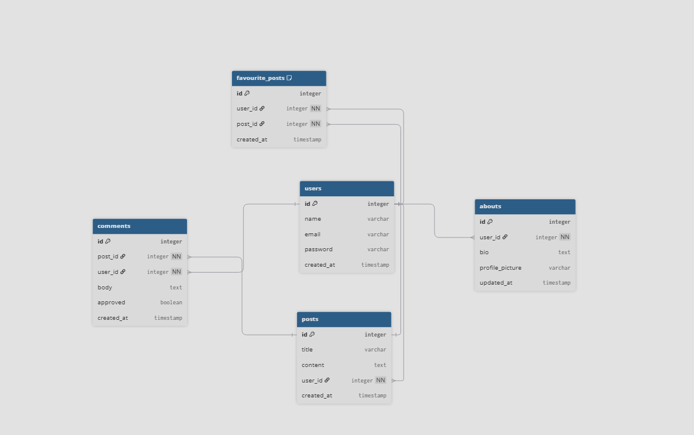
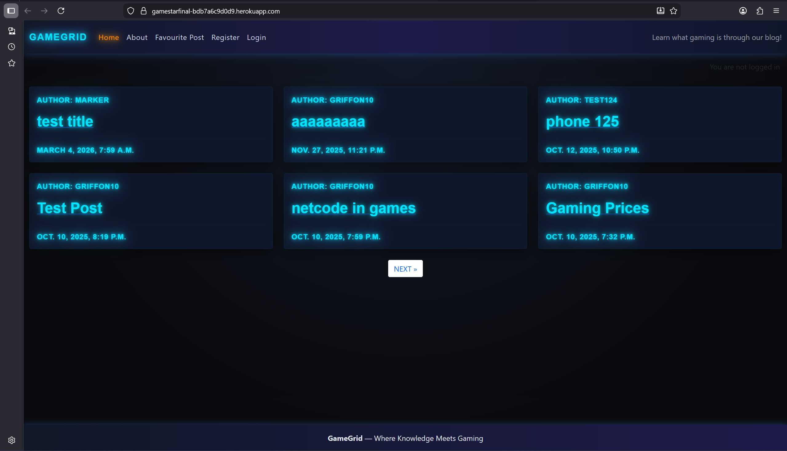
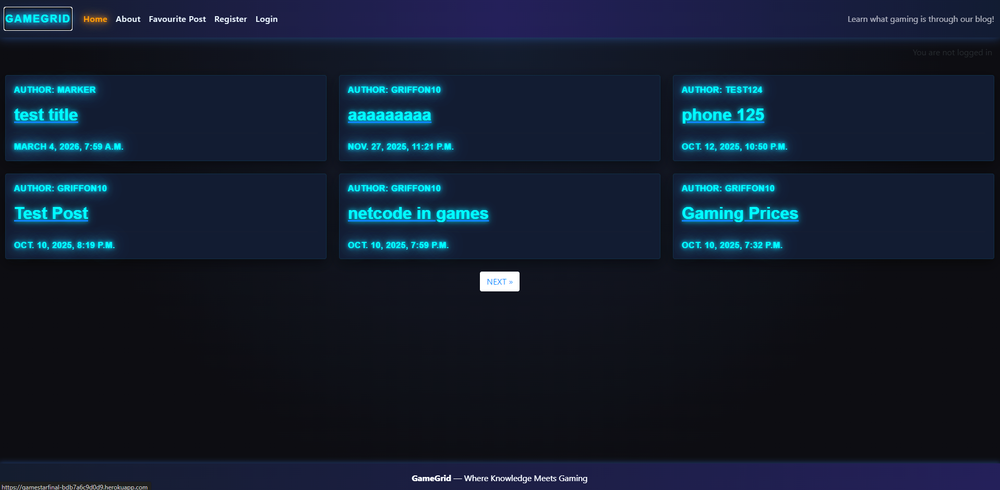
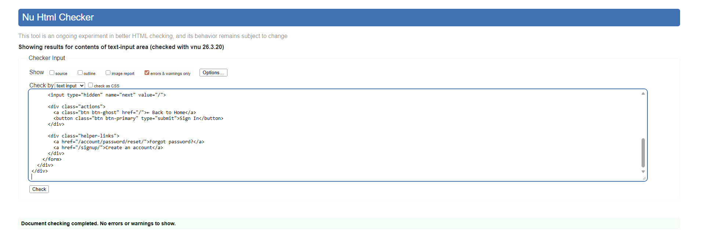
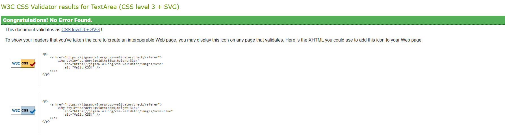

# **GameGrid Blog**

## **Table of Contents**
1. [Introduction](#introduction)  
2. [User Experience (UX) Design](#user-experience-ux-design)  
3. [User Stories](#user-stories)  
4. [Features](#features)  
5. [Future Features](#future-features)  
6. [Entity Relationship Diagram (ERD)](#entity-relationship-diagram)  
7. [Testing](#manual-testing)        
9. [Credits](#credits)

## **Introduction**
This is django project created within the weeks provided allowing me to have created the gaming blog website!

This is the GameGrid Blog — a space built by gamers, for gamers. Here, players from all corners of the gaming world can share their thoughts, debate hot topics, and celebrate the games that shape our lives. Whether it’s deep-dive reviews, first impressions of new releases, nostalgic throwbacks, or discussions about the latest gaming news, GameGrid is your arena to speak your mind.

Join the conversation, drop your opinions, and connect with a community that understands your passion for gaming. On GameGrid, every voice matters — from casual players to hardcore pros.

**[Visit the Site](https://gamestarfinal-bdb7a6c9d0d9.herokuapp.com/)** 

## **User Experience (UX) Design**

### **Design Goals**
- Provide an
- Maintains the gaming feel thoughout the website
- Responsiveness Across Devices 

### **Typography**

This project uses two main fonts for a modern gaming aesthetic:

- **Roboto** – for clean, readable body text.  
  Source: [Google Fonts](https://fonts.google.com/specimen/Roboto)

- **Mangold** – for the bold, neon-styled headings and the GameGrid logo.  
  Source: [Google font inspiration](https://fonts.google.com/specimen/Oxanium)

### **Colour Palette**

 - Neon Cyan — #00E5FF
- Electric Blue — #3B82F6
- Neon Orange — #FF8C00
- Bright Amber — #FFA733
- Midnight Navy — #0F172A
- Dark Space Blue — #0B0F1A
- Steel Blue-Gray — #111827
- Muted Gray-Blue — #CBD5E1
 -Cool Gray — #94A3B8
- Soft Off-White — #E2E8F0
- Amber Glow — #FFAE42

[Back to Table of Contents](#table-of-contents)

## **Wireframes**

### Mobile Wireframes
These are my mobile wireframes showing the individual website pages.  
*(The cdesigns are the concept some have little change in final product.)*

  
  

### Desktop Wireframes
These are my Desktop wireframes showing the individual website pages.  
*(The cdesigns are the concept some have little change in final product.)*

  
  
  
  
   
  
   
  

[Back to Table of Contents](#table-of-contents)

## User Stories
## User Stories

### 📰 Open a Post
**As a Site User**, I can click on a post so that I can read the full text.

**Acceptance Criteria**
- **AC1:** When a blog post title is clicked, a detailed view of the post is displayed.

---

###  View Comments
**As a Site User / Admin**, I can view comments on an individual post so that I can read the conversation.

**Acceptance Criteria**
- **AC1:** Given one or more user comments, the admin can view them.
- **AC2:** A site user can click on the comment thread to read the conversation.

---

###  Account Registration
**As a Site User**, I can register an account so that I can comment on a post.

**Acceptance Criteria**
- **AC1:** Given an email, a user can register an account.
- **AC2:** Then the user can log in.
- **AC3:** When the user is logged in, they can comment.

---

### Comment on a Post
**As a Site User**, I can leave comments on a post so that I can be involved in the conversation.

**Acceptance Criteria**
- **AC1:** When a user comment is approved, it becomes visible.
- **AC2:** A user can reply to comments.
- **AC3:** Given more than one comment, there is a conversation thread.

---

### Modify or Delete Comment
**As a Site User**, I can modify or delete my comment on a post so that I can manage my participation in the conversation.

**Acceptance Criteria**
- **AC1:** A logged-in user can modify their comment.
- **AC2:** A logged-in user can delete their comment.

---

###  Manage Posts
**As a Site Admin**, I can create, read, update, and delete posts so that I can manage my blog content.

**Acceptance Criteria**
- **AC1:** A logged-in user can create a blog post.
- **AC2:** A logged-in user can read a blog post.
- **AC3:** A logged-in user can update a blog post.
- **AC4:** A logged-in user can delete a blog post.

---

###  Create Drafts
**As a Site Admin**, I can create draft posts so that I can finish writing the content later.

**Acceptance Criteria**
- **AC1:** A logged-in user can save a draft blog post.
- **AC2:** The user can finish and publish the content later.

---

### Approve Comments
**As a Site Admin**, I can approve or disapprove comments so that I can filter out objectionable comments.

**Acceptance Criteria**
- **AC1:** A logged-in user can approve a comment.
- **AC2:** A logged-in user can disapprove a comment.

### Favorites Functionality

**As a Django logged-in user**, I can add or remove blog posts from my favorites and view them later so that I can quickly access posts I like.

**Acceptance Criteria**
- **AC1:** Given a logged-in user, they can mark (add) a blog post as a favorite via a Django view or API endpoint.  
- **AC2:** Given a logged-in user, they can remove a blog post from their favorites via a Django view or API endpoint.  
- **AC3:** Given a logged-in user, they can view a list of all blog posts they’ve marked as favorites on a dedicated **“Favorites”** page or API endpoint.

### Create a New Post

**As a logged-in user**, I can create a new blog post using the "Create a New Post" form so that I can share my ideas and updates on the blog.

**Acceptance Criteria**
- Only authenticated (logged-in) users can access the **Create a New Post** page.  
- The form includes input fields for **Title** and **Content**.  
- When the **Publish** button is clicked, the post is submitted and saved.  

[Back to Table of Contents](#table-of-contents)

## Features

### Home Page

   
  <em>Displays the blogs that have been created.</em>

### Footer

   
  <em>Displays the speech within it.</em>

### Authentication
- **Register:** User  Register.

   
  <em>Displays the create account features.</em>

- **Sign-In:** secure login with remember-me.

   
  <em>Displays the sign in screen.</em>

- **Sign-Out:** safe session termination.

   
  <em>Displays the are you sure screen.</em>

### Comments
- Add/edit/delete comments; visible underneath the blog.  

   
  <em>Displays the are you sure screen.</em>

   
  <em>Displays the Verification to delete a comment.</em>

### posts
- Add/edit/delete comments; visible underneath the blog to only users that created the post.  

   
  <em>delete button on created posts by user.</em>

   
  <em>Displays the Verification to delete a .</em>

   
  <em>Displays the form like format to create post.</em>

### Favourite posts
- Add/remove: able to favourite other users post/yourselfs.  

   
  <em>adding any post and ends in this  page , to view.</em>

[Back to Table of Contents](#table-of-contents)

## Future Features

- Pictures that can be implemented on posts to suit the topics to users

## Entity Relationship Diagram

   
  <em>adding any post and ends in this  page , to view.</em>

[View the Entity Relationship Diagram (ERD) on dbdiagram.io](https://dbdiagram.io/d/ERD-update-diagram-68dae805d2b621e42277936d)

[Back to Table of Contents](#table-of-contents)

## **Manual Testing**
-  testing the website across different browsers such as mictosoft edge / google chrome / firefox
                  

   
  <em>FireFox.</em>

   
  <em>Microsoft edge.</em>

   
  <em>google chrome.</em>

## **Responsive Testing**
- Made Sure the website is visible and works across devices such as mobile , tablet and desktop

   ## **Mobile**

   
  <em>Samsung Galaxy S8+</em>

   
  <em>Iphone SE</em>

 

   
  <em>Pixel 7</em>

  ## **Tablet's**
 

   
  <em>ipad pro</em>

 

   
  <em>Surface pro 7</em>

   
  <em>Surface pro 7</em>

 ## **Desktop**

   
  <em>PC</em>

## **Validator Testing**
- TML, CSS, JavaScript, and Python code were validated using tools such as W3C Validators(HMTL, CSS)

## **HTML**
 I used the W3C HTML to validate the JavaScript code added to the project.

 

   
  <em>home page</em>

 
 

   
  <em>login</em>

 

   
  <em>sign up ( 1 error and 1 warning involving the child element but doesnt effect code nor the website)</em>

 

   
  <em>logout</em>

## **CSS**
- I used W3C CSS to validate the JavaScript code added to the project.

   
  <em></em>

## **javeScript**

I used JSHint to validate the JavaScript code added to the project.

   
  <em></em>

## **Python**
I used CI Python Linter was used to validate the Python files that were created or edited by myself. No issues but errors that dont effect code and are only indentation issues. I have included some screenshots with the results below.

   
  <em></em>

   
  <em></em>

   
  <em></em>

   
  <em></em>

## **Light house testing**
 

   
  <em></em>

   
  <em></em>

## **Deployment**
## connecting with github
- Log in to GitHub or create an account if you don’t already have one.
Go to the CI Full Template.
- Click the green "Use this template" in the top right and select "Create a new repository".
 - Enter a name for your new repository and click "Create repository from template".
- Once the repository is created, click the green "Open " button (if you are using GitPod) to generate a new workspace.

 ## Django Project Setup
 -  Install Django
- Run the following command to install Django:
pip3 install Django~=4.2.1
- Create a Requirements File
- Generate a requirements.txt file that lists your project's dependencies:
- pip3 freeze --local > requirements.txt
- Create a New Django Project
- Create your Django project. Replace proj_name with the desired project name. Don’t forget the . at the end of the command!
django-admin startproject proj_name .
- Apply Pre-Built Django Account Migrations
- Run the following command to apply Django’s default migrations:
python3 manage.py migrate
- Run the Development Server
- Start the server to test your project:
python3 manage.py runserver
- You will see a yellow error screen. Don’t worry, your server is running properly. The error occurs because Django doesn’t recognize the hostname your project is running on.
Configure ALLOWED_HOSTS

- Select and copy the hostname displayed in the error message after "Invalid HTTP_HOST header." For example:
'8000-nielmc-django-project-0kylrta3cs.us2.codeanyapp.com'
- Add the hostname to the ALLOWED_HOSTS list in your settings.py file:
ALLOWED_HOSTS = ['8000-nielmc-django-project-0kylrta3cs.us2.codeanyapp.com']
- Add CSRF Trusted Origins
Immediately below the ALLOWED_HOSTS variable, add the following line to -  allow your IDE and Heroku to pass CSRF verification:
CSRF_TRUSTED_ORIGINS = ['https://*.codeinstitute-ide.net', 'https://*.herokuapp.com']

## Creating an app
- Create a new Django app. Replace app_name with the desired app name:
python3 manage.py startapp app_name
- Add App to INSTALLED_APPS

- Open your settings.py file and add the app name to the INSTALLED_APPS list:
INSTALLED_APPS = [
    ...
    'app_name',
]
- Save the file after making the changes.

## Create Necessary Folders
- In the IDE file explorer or terminal, create the following three folders in the top-level directory:
media

static

templates
- Install WhiteNoise
- Run the following command to install WhiteNoise:
pip3 install whitenoise~=5.3.0
- After installation, freeze your requirements using the freeze command.
pip3 freeze --local > requirement.txt
- Wire Up WhiteNoise in settings.py
- Add WhiteNoise to Django's middleware in settings.py. The line should be added directly after the SecurityMiddleware:
   MIDDLEWARE = [
    'django.middleware.security.SecurityMiddleware',
    'whitenoise.middleware.WhiteNoiseMiddleware',
    …,
]
## Prerequisites Before Deploying to Heroku
- Install Gunicorn and Freeze Requirements
- First install Gunicorn, a web server for running Python applications.
pip3 install gunicorn~=20.1
- Once this is complete update your requirements.txt file:
pip3 freeze --local > requirements.txt
##  Create a Procfile

- Create a new file named Procfile in the root directory of your project.
Note: This file has no file extension, and the P must be capitalized.
- Add the following line to your Procfile to define the application process:

- Make sure to change proj_name.wsgi to the project name you set above in step 3
web: gunicorn proj_name.wsgi
- Add Deployed App to ALLOWED_HOSTS
- In settings.py, add your Heroku app URL (or the deployed website URL) to the ALLOWED_HOSTS list. Do not include https:// or a trailing /. For example:
ALLOWED_HOSTS = ['yourprojecturl-7fbns8df.herokuapp.com']

## Database Setup (PostgreSQL)
- The website uses PostgreSQL hosted Code Institute
- A link is provided to create a database using the CI Database Maker.
- Enter your email address and click create database.
- Check your emails for your database_url and a link to all your database information.

## Connecting to your database.
- Install Database Packages

- Run the following command to install the necessary database packages:
pip3 install dj-database-url~=0.5 psycopg
- After installation, freeze your requirements using the freeze command.
- This will update the requirements.txt
pip3 freeze --local > requirements.txt
- Create env.py File

- In the root directory of your project, create a new file named env.py.
- Add env.py to .gitignore

- Open your .gitignore file and add the following line:
env.py
- Note:* If you are using the CI template, this is already included.
Import the os Library
- At the top of the env.py file, add this line of code:
import os
- Set Environment Variables
- In env.py, add the following code:
os.environ["DATABASE_URL"] = "Paste the PostgreSQL database URL inside these double quotes"
- Add a Secret Key
- In env.py, add the following line:
I used Djecrety to make my secret key.
os.environ["SECRET_KEY"] = "Make up your own randomSecretKey"
Update settings.py
- Import Necessary Modules
- Update the top of your settings.py file with the following:
from pathlib import Path
import os
import dj_database_url

if os.path.isfile("env.py"):
    import env
I changed my DEBUG at this point to make sure I never forgot to change it to Fause before deploying. (This is not needed
If os.path.isfile("env.py"):
   import env
   DEBUG = True
else:
    DEBUG = False
- Replace the Insecure Secret Key
- Remove the hardcoded secret key and replace it with:
SECRET_KEY = os.environ.get('SECRET_KEY')
- Comment Out the Old DATABASES Section
- Comment out the default SQLite database configuration:
DATABASES = {
    'default': {
        'ENGINE': 'django.db.backends.sqlite3',
        'NAME': BASE_DIR / 'db.sqlite3',
     }
#}
- Add New DATABASES Section
- Replace it with the following to link to the DATABASE_URL variable on Heroku:
DATABASES = {
    'default': dj_database_url.parse(os.environ.get("DATABASE_URL"))
}
- Save All Files and Make Migrations
- Run the following command:
python3 manage.py migrate
- Creating a Super User
- Creating a super user in Django is an important step to gain access to the admin interface with extra privileges.
- Run the following command:
python3 manage.py createsuperuser

## Deploying to Heroku
- Navigate to Your Heroku Dashboard

- Log in to Heroku or create a new account, then navigate to the Heroku Dashboard.
- Create a New Heroku App

- Click Create New App.
- Choose a unique app name.
- Select a region close to your location.
- Add Config Var in App Settings

- Go to the Settings tab of your app.

- Scroll down to Config Vars and click Reveal Config Vars.

- Add a new key-value pair:

Key: DISABLE_COLLECTSTATIC

Value: 1
- Connect to Repository

- In your Heroku app, navigate to the Deploy tab.
Click GitHub then search for your repository and select it.
Check for Add-ons

- Navigate to the Resources tab.
- Delete any Postgres DB add-ons (if they are not required.)
- Add Secret Key to Config Vars

- Add a config variable with the following details:
Key: SECRET_KEY

Value: randomSecretKey
- Add a Config Var for DATABASE_URL
- Add another config variable with the following details:
- Key: DATABASE_URL

- Value: Your PostgreSQL database URL from the previous step.
Add database url to Heroku Config Vars
- In Heroku, navigate to the Settings tab and add a Config Var with the following details:
Key: Database_URL

Value: database://************************

## Clone the Project
- To create a local clone of this repository from GitHub, follow these steps:

- Log in to GitHub:
- Ensure you are logged into your GitHub account.
- Locate the Repository:
- Copy the Repository URL:
- Above the list of files in the repository, click the "Code" button.
- Select your preferred cloning method: HTTPS, SSH, or GitHub CLI.
- Click the "Copy" button to copy the repository URL to your clipboard.
- Open Your Terminal:
- Launch your terminal or Git Bash.
- Navigate to Your Desired Directory:
- Change the current working directory to the location where you want to clone the repository.
- Clone the Repository:
- Use the git clone command followed by the copied URL:
  - git clone https://github.com/YOUR_USERNAME/YOUR_REPOSITORY.git
  cd YOUR_REPOSITORY
- Install Dependencies:
- Navigate to the project directory and install the required dependencies by running:
 pip install -r requirements.txt
- Set Up the env.py File:
- Create an env.py file to store sensitive data such as your database-  API key and PostgreSQL URL.
- Add the following to your env.py file:
import os
os.environ["DATABASE_URL"]="<your_postgresql_url>"
os.environ["SECRET_KEY"]="<your_secret_key>"
os.environ["Database_URL"]="<your_database_api_key>"
- Add env.py to .gitignore:

- Ensure the env.py file is listed in your .gitignore file to prevent sensitive information from being pushed to GitHub.
- Follow the Remaining Setup Steps:

- Complete the rest of the Django project setup process as detailed in the above instructions before pushing your code to GitHub.

## **kanbanboard**
[Agile board](https://github.com/users/AnasEljandi/projects/9)
## **Credits**
- Ai usage = During this project, I used AI tools such as ChatGPT to support my learning and development process. I mainly used AI as a way to ask questions about code I had written, helping me check that my syntax was correct and that different parts of the project were working as expected.
 I found AI particularly useful when I was unsure about certain errors or needed clarification, as it helped me understand what was going wrong rather than just giving me a solution. This allowed me to fix issues more efficiently while still learning from the process.
-I also used AI to help refine my initial idea for the website. By prompting it with my concept, I was able to explore suggestions for how to structure the blog and improve the overall design. I then took those ideas and developed them further in my own way to suit the goals of my project.
 Additionally, AI supported me with UX and performance ideas, which helped me think more about how users would interact with the site. This improved both the usability of the project and my overall workflow, as I was able to work more efficiently and with greater confidence.
Overall, I used AI as a support tool to guide my thinking, improve my understanding, and speed up development, while ensuring that all final decisions and implementations were my own.
- dbdiagram = i have used this for ERD diagram
- Coolors = for the colous and reference
- google font = took some inspiration of fonts from the website
- boostrap = took inspiration from some boostrap
- balsamiq = for wire frames